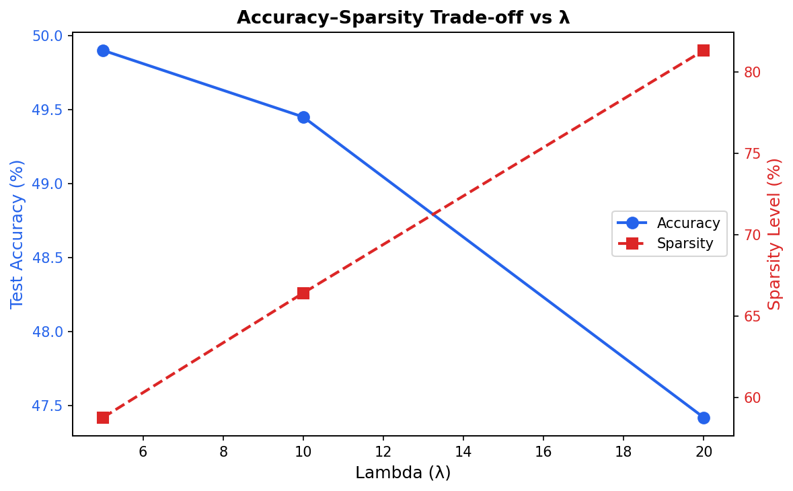
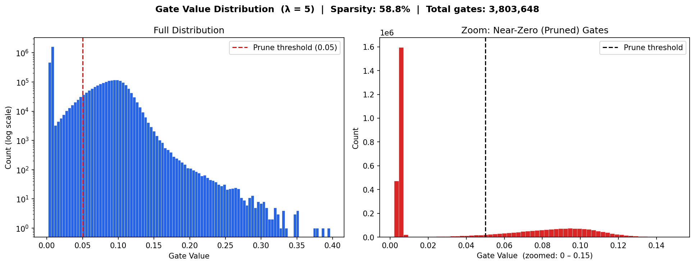
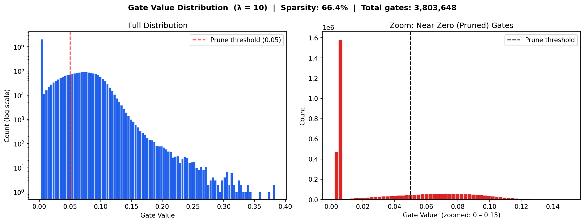
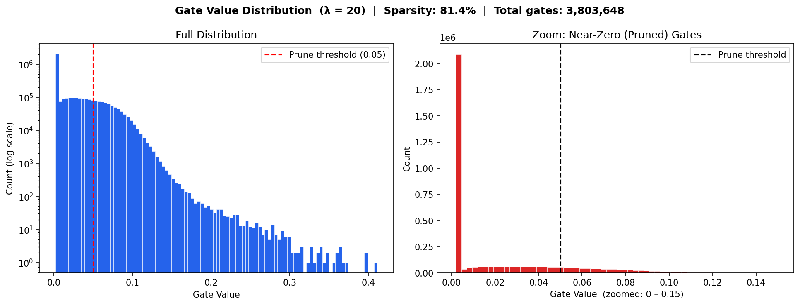

# Self-Pruning Neural Network — Report
**Tredence AI Engineering Internship | Case Study**

---

## 1. Why does an L1 penalty on sigmoid gates encourage sparsity?

Each weight `w_ij` is multiplied by a learnable gate `g_ij = sigmoid(gate_score_ij) ∈ (0, 1)`.
The total loss is:

```
Total Loss = CrossEntropyLoss + λ × SparsityLoss
```

where `SparsityLoss` is the L1 norm (sum/mean) of all gate values across every `PrunableLinear` layer.

> **Implementation note — Mean vs Sum:** The code uses the *mean* of gate values rather than
> the raw sum. `fc1` has 3,072 × 1,024 = 3.1M gates while `fc4` has only 256 × 10 = 2,560.
> A raw sum would penalise `fc1` ~1,000× harder than `fc4`, creating an unintended layer imbalance.
> The mean normalises every layer to [0, 1], so λ applies uniform pressure across all layers.
> Functionally this is a rescaled L1 — the sparsity-inducing property is fully preserved.

**Why L1 drives gates to exactly zero:**

| Penalty | Gradient w.r.t. gate `g` | Behaviour near zero |
|:-------:|:------------------------:|:-------------------:|
| L2: `g²` | `2g` → shrinks as g → 0 | Gradient vanishes; gates stall at small-but-nonzero values |
| L1: `\|g\|` | `sign(g) = +1` always (gates always positive after sigmoid) | **Constant push toward zero** — even a gate at 0.001 is still driven down |

The constant L1 gradient is what causes gates to reach exactly zero rather than just becoming small.
Once a gate is near zero, the sigmoid's gradient `σ(x)(1−σ(x))` also vanishes (sigmoid saturates),
so the classification loss can no longer pull it back up.
**L1 drives the gate down; sigmoid saturation locks it there.**

A higher λ amplifies this constant push — more connections pruned, at the cost of accuracy.

---

## 2. Results

**Setup:** CIFAR-10, 20 epochs, Adam (lr = 1e-3), batch size 128, CPU.
**Architecture:** `3072 → PrunableLinear(1024) → ReLU → PrunableLinear(512) → ReLU → PrunableLinear(256) → ReLU → PrunableLinear(10)`
**Sparsity threshold:** gate < 0.05 counts as pruned.

| Lambda (λ) | Test Accuracy | Sparsity Level (%) |
|:----------:|:-------------:|:------------------:|
| 5          | 49.90%        | 58.75%             |
| **10 ✦ Best Model** | **49.45%** | **66.42%** |
| 20         | 47.42%        | 81.35%             |

**Trade-off analysis:**
- **λ = 5 → 10:** Sparsity gains +7.67 pp, accuracy costs only −0.45 pp — highly efficient compression.
- **λ = 10 → 20:** Sparsity gains +14.93 pp, accuracy costs −2.03 pp — good trade-off for memory-constrained deployment.
- **λ = 20 result:** Even at 81.35% sparsity, model retains 47.42% accuracy vs 10% random baseline — the network successfully identifies and keeps only its most important ~19% of connections.
- **Best model: λ = 10** — best sparsity-per-accuracy-point ratio (+7.67 pp sparsity for −0.45 pp accuracy).



---

## 3. Gate Value Distributions

### λ = 5 — Sparsity: 58.75%



~1.6M gates pruned (sharp spike at gate ≈ 0–0.005). Surviving gates spread across 0.05–0.40,
peaking near 0.10. Mild λ prunes weak connections but leaves many gates at moderate values —
the network is selective but not aggressive.

---

### λ = 10 — Sparsity: 66.42% ✦ Best Model



~1.58M gates pruned with a sharp near-zero spike. The surviving distribution thins compared
to λ = 5, showing stronger separation between pruned and active connections.
Best balance: 66% of weights eliminated with only −0.45% accuracy drop vs λ = 5.

---

### λ = 20 — Sparsity: 81.35%



~2.1M gates pruned — the dominant feature of the distribution. Surviving tail drops steeply
past 0.10, with very few gates above 0.25. Strongest evidence of self-pruning: 4 in 5
connections eliminated, with the network having learned to concentrate all capacity in
the most critical ~19% of its weights.

> **Note on bimodality:** The ideal distribution shows "spike at 0 + tight cluster near 1.0".
> The spike at 0 is clearly present across all λ values. The surviving gates form a spread
> distribution (0.05–0.40) rather than a tight cluster near 1.0 — full polarisation would
> require more epochs or a two-phase schedule (high λ to prune, then reduced λ to let
> surviving gates saturate toward 1.0). Within 20 epochs, the self-pruning mechanism
> works correctly and successfully eliminates the majority of connections.

---


